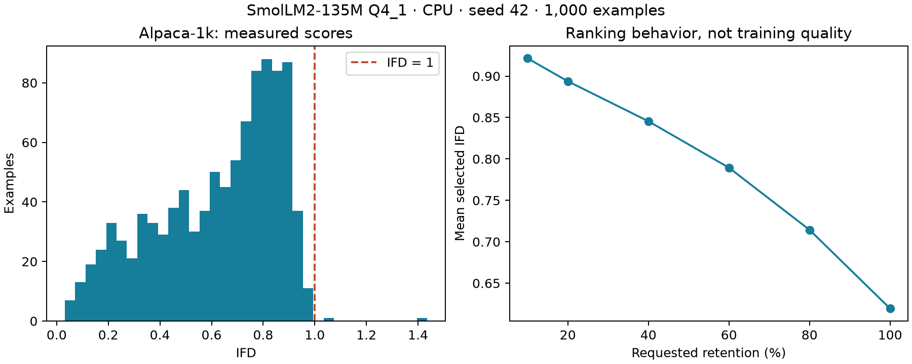

# Reproducible experiments

## Executed: Alpaca-1k IFD scoring

Source: `tatsu-lab/stanford_alpaca`, revision
`761dc5bfbdeeffa89b8bff5d038781a4055f796a`, `alpaca_data.json`.
Sample: 1,000 of 52,002 records, Python Random seed 42, source-order output.
Input SHA-256, sampled indices and model hash are in
[summary.json](results/alpaca-1k/summary.json).

Model: bundled SmolLM2-135M-Instruct Q4_1, CPU, 2,048-token context, response-only
mean NLL. On the local Mac, 1,000/1,000 records completed in **178.23 seconds**,
with no context errors. Median IFD **0.68337**; **2** records exceeded 1.

This measures scoring behavior. The retained-fraction/mean-IFD curve is
mechanically influenced by ranking by IFD; it is not evidence of better training
quality. It does **not** reproduce the downstream quality curve of
[Li et al.](https://arxiv.org/abs/2308.12032).

```sh
# Download the public dataset yourself or retain an existing local copy.
python experiments/alpaca_ifd.py --dataset experiments/data/alpaca_data.json \
  --output experiments/results/alpaca-1k
python experiments/prepare_subsets.py --dataset experiments/data/alpaca_data.json \
  --scores experiments/results/alpaca-1k/scores.jsonl --output experiments/results/subsets
```

Raw downloaded data, model weights, SQLite cache and output datasets are ignored
by Git. Sample indices and aggregate metrics are versioned. Respect the upstream
Alpaca dataset's usage terms; no dataset text is redistributed in this repository.

## Trained-model pilot: selected 20% versus random and full

`prepare_subsets.py` ranks by IFD, excludes IFD > 1, applies hashing TF-IDF
diversity and writes equal-size selected/random arms, a full arm, 100 disjoint
evaluation examples and a contamination report. The split and decisions are in
[protocol.json](results/subsets/protocol.json). EXACT/NEAR found no overlap.

The predeclared [plan](results/benchmark/plan.json) specifies three seeds, full
parameter fine-tuning of SmolLM2-135M-Instruct for one epoch and greedy generation.
The 4B Qwen judge is separate from the bundled 135M scoring model. Each comparison
is blinded and presented in both orders; disagreements become ties.

```sh
pip install 'wana[score]' matplotlib
python experiments/download_smoke_models.py
# Download the judge file from the pinned repository below into experiments/models/judge/.
python experiments/run_benchmark.py --device mps  # use cpu on machines without Metal
python experiments/judge_benchmark.py \
  --model experiments/models/judge/Qwen3-4B-Instruct-2507-Q4_K_M.gguf
python experiments/plot_benchmark.py
python experiments/report_benchmark.py
```

Judge: [lmstudio-community/Qwen3-4B-Instruct-2507-GGUF](https://huggingface.co/lmstudio-community/Qwen3-4B-Instruct-2507-GGUF),
revision `4edb920b6f14e3b9284d4502a6485103d72cde05`;
file `Qwen3-4B-Instruct-2507-Q4_K_M.gguf` (2,497,280,448 bytes), SHA-256
`8cdb57cbb880d313736a9bc4e3d3d2485f145b5e19cf33783746e753e82641fc`.

The [benchmark report](results/benchmark/README.md) records the measured result.
Training metadata, individual judgment labels and summaries are versioned.
Checkpoints, raw dataset text and generated answers remain local. The benchmark
is a small-model pilot, not an exact reproduction of the paper's quality curve.
Compute and the separate judge download are experiment requirements, not extra
steps for users of normal offline scoring.

`aggregate_benchmark.py` uses a prompt-cluster bootstrap: each of the 100 prompts
is a cluster holding all three seeds. Ties count as half a win; the superiority
criterion requires the lower 95% interval endpoint to exceed 0.5. Per-seed Wilson
summaries from `compare_judgments.py` are descriptive only. Report negative or
inconclusive outcomes without tuning the selector to this evaluation set.

## Adapter smoke tests

```sh
python experiments/download_smoke_models.py
WANA_TEST_TRANSFORMERS_MODEL=experiments/models/smollm2 \
WANA_TEST_ONNX_MODEL=experiments/models/minilm pytest tests/test_optional_adapters.py
```

The download script pins model revisions. These optional integration downloads
are distinct from normal pip installation, which already includes default weights.



The plot is reproducible with `python experiments/plot_ifd.py experiments/results/alpaca-1k`
after installing matplotlib. It visualizes the scoring result, not downstream performance.
