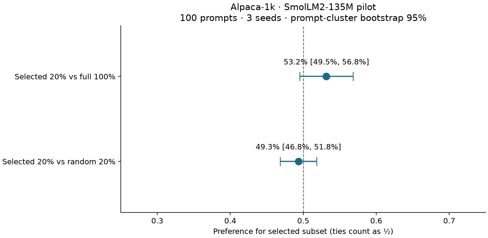

# Alpaca-1k trained-model pilot

Three full-parameter fine-tuning seeds (42, 43, 44), one epoch, learning rate
2e-5, SmolLM2-135M-Instruct, Metal. The selected arm uses 200 examples ranked
by IFD with hashing TF-IDF diversity; the random arm has 200 examples and the
full arm 1,000. Random subsets vary by seed; the selected subset is fixed.

All arms generate greedy answers (128 new tokens maximum) for the same 100
held-out Alpaca prompts. Qwen3-4B-Instruct-2507 Q4_K_M judges each pair in both
orders with blinded arm labels. Order disagreement becomes a tie. The
reference answer assists the judge; it is not assumed to be infallible.

## Results

| Comparison | Selected wins | Baseline wins | Ties | Preference (ties = ½) | Clustered 95% interval |
| --- | ---: | ---: | ---: | ---: | --- |
| Selected vs random | 16 | 20 | 264 | 49.3% | 46.8%–51.8% |
| Selected vs full | 43 | 24 | 233 | 53.2% | 49.5%–56.8% |

The two arms produced identical answers in 113/300 primary pairs, which are counted as ties without calling the judge.

Changing answer order changed the judge's decision in 59/300 primary pairs and 73/300 secondary pairs. These pairs are counted as ties.

The primary comparison did **not** meet the superiority criterion.
The criterion requires the lower endpoint of the prompt-cluster bootstrap
interval to exceed 50%. This is an exploratory small-model pilot with one
quantized model judge, not an exact replication of the IFD paper or a human
quality evaluation. Failure to establish superiority does not establish
equivalence. Hyperparameters and selection were not tuned to judge outcomes.

## Reproduction and audit

The predeclared settings are in [plan.json](plan.json). The scripts and
commands are described in [experiments/README.md](../../README.md). Raw
datasets, answers and checkpoints remain local; hashes, training metadata,
individual decisions and summaries are versioned. No upstream dataset text
is redistributed. EXACT/NEAR checks found no split overlap; semantic or
pretraining contamination is not ruled out.

The bootstrap resamples the 100 prompts and preserves their three seed
results together (10,000 replicates, seed 42). It quantifies uncertainty over
these prompts, conditional on these three training runs and this judge.

Judge SHA-256: `8cdb57cbb880d313736a9bc4e3d3d2485f145b5e19cf33783746e753e82641fc`.
