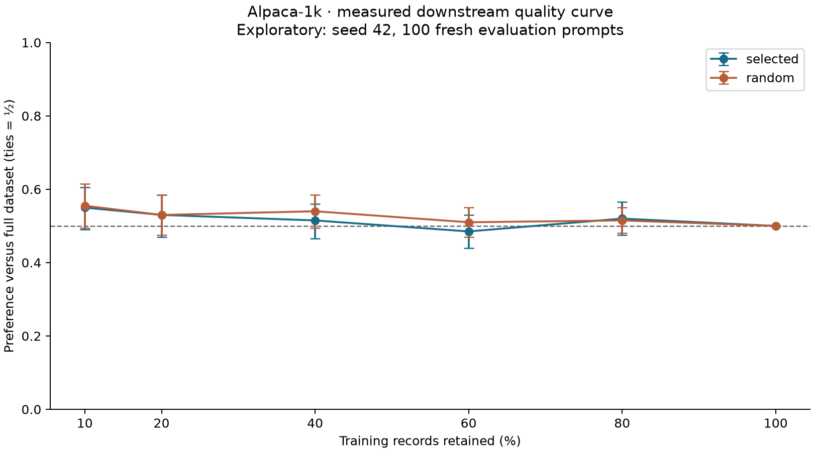

# Corrected retention-budget pilot

Completed using the fixed [plan](plan.json), declared before judging.

## Primary comparison: selected 20% versus random 20%

Three seeds, 100 fresh prompts: **29 wins, 39 losses, 232 ties**.
Preference (ties count as half): **48.3%**, clustered 95% interval **45.5%–51.2%**.
The superiority criterion was **not met**.

## Quality versus retention budget

Each point compares generated answers from a trained subset model against
the model trained on all 1,000 records. At 100%, both are the same model
and the score is 50% by definition. The curve uses one training seed; its
intervals resample prompts and do not measure variation across training seeds.

| Retained | Selected preference vs full | Random preference vs full |
| --- | ---: | ---: |
| 10% | 55.0% | 55.5% |
| 20% | 53.0% | 53.0% |
| 40% | 51.5% | 54.0% |
| 60% | 48.5% | 51.0% |
| 80% | 52.0% | 51.5% |
| 100% | 50.0% | 50.0% |

## Corrections and limits

Training now learns the end-of-response token. The two judge orders
use the paper's aggregation policy: a win plus a tie counts as a win;
opposing wins remain a tie. Old and new evaluation sets are disjoint.
The previous pilot is retained unchanged. Selection settings were not
tuned against either evaluation set. Individual decisions and metadata
are included; raw dataset text and generated answers remain local.

This measures downstream quality at six budgets, but adapts the paper
to a 135M instruction model, 1,000 records and one epoch. It does not
reproduce the original LLaMA-7B pre-experience stage, training or judge.
The single quantized judge is not human ground truth. A null result
does not establish equivalence or justify changing the acceptance threshold.

Reproduce: `python experiments/retention_curve.py` then
`python experiments/report_retention_curve.py`.
